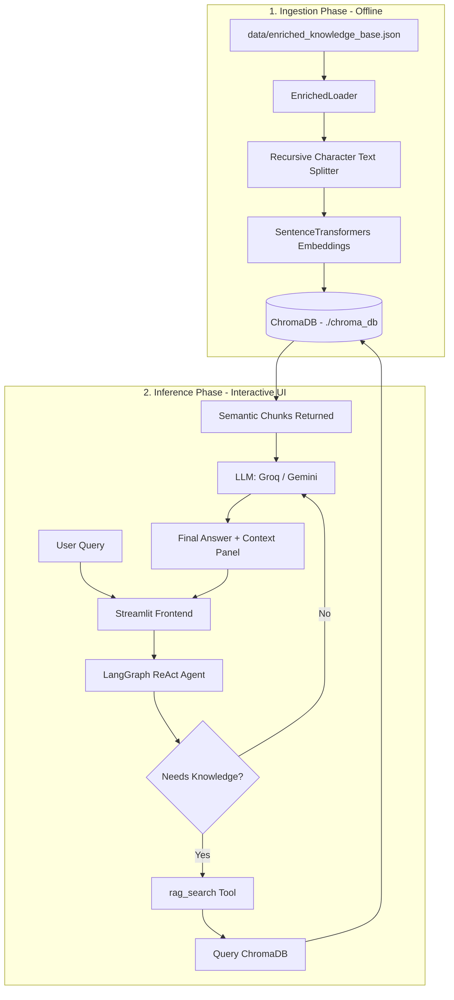

# RAG Agent Architecture Document

This document explains the technical architecture of the Retrieval-Augmented Generation (RAG) agent pipeline, focusing on how knowledge is ingested, searched, and generated.

---

## 1. System Overview

The system is a plug-and-play RAG chatbot designed around two independent phases: **Ingestion** (offline vector store construction) and **Inference** (agentic runtime with conversation state).



---

## 2. The Retrieval Mechanism (How Matching Works)

The matching mechanism in this pipeline is a **Hybrid Search (Ensemble Retrieval)** system. It combines two complementary search strategies:
1. **Semantic Vector Search (Dense Retrieval)** — Matches intent/meaning using dense neural embeddings.
2. **BM25 Keyword Search (Sparse Retrieval)** — Matches exact keyword occurrences and counts term frequencies using the Okapi BM25 algorithm.

### How the Hybrid Search Works:
1. **Semantic Processing**: 
   When text is ingested, the embedding model converts blocks of text into a high-dimensional vector (a list of 384 numbers). This vector acts as a mathematical representation of the *meaning* of the text. When querying, it searches ChromaDB using L2 (Euclidean) distance to retrieve conceptually similar context (e.g. matching "debt settlement" with "creditor payment reduction").
2. **Keyword Processing**:
   Simultaneously, the BM25 retriever indexes terms and computes term frequency/inverse document frequency scores to locate exact keyword matches (e.g. matching the exact phrase "factor rate" or numeric IDs).
3. **Ensemble & Reranking (Reciprocal Rank Fusion - RRF)**:
   Instead of using a heavy machine-learning-based cross-encoder (which would require separate APIs or heavy GPU inference), LangChain's `EnsembleRetriever` uses **Reciprocal Rank Fusion (RRF)** to merge and rerank the results.
   
   RRF calculates a score for each retrieved document $d$ based on its rank in the individual retrievers' results lists:
   
   $$RRF\_Score(d \in D) = \sum_{m \in M} \frac{w_m}{k + r_m(d)}$$
   
   Where:
   - $M$ is the set of retrievers (BM25 and Chroma).
   - $w_m$ is the weight assigned to retriever $m$ (both set to `0.5` in this project).
   - $r_m(d)$ is the position (rank) of document $d$ in the list returned by retriever $m$ (if $d$ is not retrieved by $m$, $r_m(d) = \infty$).
   - $k$ is a constant parameter (default is `60`) used to dampen the impact of highly-ranked documents, preventing outliers from dominating.
   
   The combined documents are sorted by their RRF score in descending order.
4. **Strict Cap**:
   To ensure the LLM's context window is not overloaded, the system strictly slices the final RRF-sorted list and returns only the **top 5 overall chunks** to the agent.


### Comparison of Matching Strategies:

| Strategy | Mechanism | Strengths | Weaknesses | In This Project? |
| :--- | :--- | :--- | :--- | :--- |
| **Keyword Matching (BM25)** | TF-IDF based term frequency matching. | Finds exact terms, acronyms, and product IDs perfectly. | Misses synonyms and conceptual phrasings. | **Yes** (Co-primary) |
| **Semantic Vector Search** | Matches intent/meaning using dense neural embeddings. | Captures context, handles synonyms naturally, resilient to phrasing. | Can miss exact unique identifiers or specialized terminology. | **Yes** (Co-primary) |
| **Hybrid Search (Ensemble)** | Reranks combined results from BM25 and Vector Search. | Best of both worlds: conceptual understanding + keyword precision. | Requires running two query steps. | **Yes** (Ensembled) |


---

## 3. Technology Stack & Component Details

| Component | Technology / Model | Role in Pipeline |
| :--- | :--- | :--- |
| **Frontend UI** | Streamlit | Conversational interface & retrieved chunks inspector. |
| **Agent Orchestrator** | LangGraph (`create_react_agent`) | ReAct loop execution, memory preservation, and tool handling. |
| **Language Model (LLM)** | Groq (`llama-3.3-70b-versatile`) or Gemini (`gemini-2.5-flash`) | Context processing, reasoning, and conversational response generation. |
| **Embedding Model** | HuggingFace `sentence-transformers/all-MiniLM-L6-v2` | Converts text chunks and queries into 384-dimensional dense vectors. |
| **Vector Database** | ChromaDB (Local SQLite/duckdb implementation) | Storage, indexing, and fast distance retrieval of document vectors. |
| **Memory Saver** | LangGraph `MemorySaver` | Volatile in-memory conversational state checkpointer. |

---

## 4. Architectural Deep Dive: Step-by-Step Execution

### Step A: Data Ingestion (`scripts/ingest.py`)
1. Raw data is loaded from `data/enriched_knowledge_base.json` via the `EnrichedLoader`.
2. Chunks are split into chunks using a character-count splitter (default `chunk_size=1000` characters, with `200` characters of overlap to maintain contextual continuity across split borders).
3. The embedding model `all-MiniLM-L6-v2` processes the text chunks in batches, generating a 384-dimension vector for each chunk.
4. The vectors, metadata (`source_type`, `topic`, `category`), and raw text are stored in the local ChromaDB database directory (`./chroma_db`).

### Step B: The Inference Loop (`app.py` & `main.py`)
1. **User input** is passed to the LangGraph ReAct agent.
2. The agent executes a reasoning step. Based on the system prompt guidelines, it invokes the `rag_search` tool to fetch domain knowledge:
   ```python
   # The tool acts as a function signature the LLM can call:
   @tool
   def rag_search(query: str) -> str:
       docs = retriever.invoke(query)
       return "\n\n---\n\n".join(doc.page_content for doc in docs)
   ```
3. The retriever embeds the LLM's query, calculates the nearest vector neighbors in ChromaDB, and returns the top 5 chunks.
4. The chunks are appended to the agent's internal message chain as a `ToolMessage`.
5. The LLM processes the retrieved chunks along with the user's message, filters out noise, strictly applies the **grounding guidelines** (no outside assumptions, no fabrication), and returns the final answer.
6. The Streamlit UI displays the response, parses the `ToolMessage` payload, and renders the extracted snippets in the sidebar/expander for transparency.
